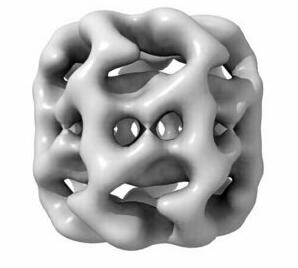
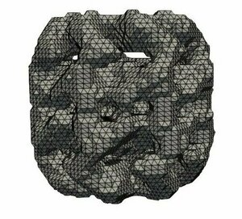

# BioSaturne Pipeline
The BioSaturne Pipeline is a chain of pre-exsisting software tools
linked together to create an unstructured volumetric mesh which can
then be used in a BioSaturne or FFEA simulation.
It can also be used to quality check a (pre-exsisting)
mesh using code_saturne capabilities.

The pipeline has been developed to run on Linux machines.

## Supported Input Formats
The BioSaturne Pipeline supports the following input formats
- [STL](#from-stl) (.stl) 
- [PDB](#from-pdb) (.pdb)
- [Cryo-EM Map](#from-emdmap) (.map)
- [Mesh](#from-msh) (.msh)
- [EMDB Entry Number](#from-emdmap) (emd_{entry number})

## Installation
To install and use the program simply download [```bio_saturne-meshingtool.py```](https://github.com/CCPBioSim/bio_saturne-meshingtool/blob/main/bio_saturne-meshingtool.py) from the repository.
This can be done by following the link to the program on GitHub, clicking Raw and then saving the
program locally.

Please refer to the installation requirements below before running the program.

## Installation Requirements
All intended uses of the pipeline requires
- [code_saturne](https://www.code-saturne.org) (ver 7.0.0+)

If you are running the pipeline to perform a quality check on a pre-exsisting mesh this is 
the only software you are required to install.

Additional software requirements depend on the format of the input as shown below.
You must install the software on your system accordingly, depending on your intended use, before running
the pipeline unless they have been installed previous.

The pipeline will check that software has been installed centrally, or alternatively that
they have been added to $PATH.

| Software                                                    | Input Format        |
| ------------------------------------------------------------| --------------------|
| [Gmsh](https://gmsh.info){"_blank"} (ver 4.10.2+)                     | stl, pdb, map, emd  |
| [ChimeraX](https://www.cgl.ucsf.edu/chimerax/) (ver 1.3+)   | pdb, map, emd       |
| [CCP-EM](https://www.ccpem.ac.uk/download.php) (ver 1.5.0+) | map, emd            |


The pipeline has been developed in Python 3.8 and therefore requires Python3 to 
run. It also depends on the following python modules all of which can be installed 
using pip.

- [PyYAML](https://pypi.org/project/PyYAML/)     
- [Matplotlib](https://pypi.org/project/matplotlib/)
- [Argparse](https://pypi.org/project/argparse/)      
- [Numpy](https://pypi.org/project/numpy/)

## Command-line Options
- ``` -i ``` The input file (including the path if it is not in the current directory).
- ``` -f ``` The format of the input file e.g. stl, emd, pdb or map.
- ``` -c ``` The [configuration](#configuration-file) yaml file (including the path if it is not in the current directory).
- ``` -hg ``` Optional flag to determine whether you want to generate [histograms](#output) based on data of the meshes quality (code_saturne).

## Configuration File
A configuation file (in the yaml format) is required for all input formats excluding a pre-exsisting mesh (.msh).
Inside the file you can specify parameters for meshing, cleaning (using CCP-EM's toolkit) and refining the STL file
(using ChimeraX). The parameters are listed below and those that are required for the pipeline to run are marked
as such.

<span style ="color:red;">*</sup></span>*Required* &nbsp; <span style ="color:red;">**</sup></span>*Required for pdb input*

- ```software```<span style ="color:red;">*</sup></span> The meshing software to generate the mesh.
- ```format```<span style ="color:red;"><sup>*</sup></span> The format of the mesh you wish to generate.
- ```name``` The filename for the resulting mesh (excluding the extension) if not provided then the
mesh file will be saved as '{input file name}_3d'.
- ```threshold``` Contour threshold for electron density map cleaning using CCP-EM.
- ```dust_filter``` Boolean value to indicate the use of CCP-EM's dust filter during map cleaning.
- ```probe_radius```<span style ="color:red;"><sup>**</sup></span> The radius of the probe in Angstroms (Å) used in ChimeraX to generate a surface<sup>[1]</sup>.
- ```grid_spacing``` Define the spacing in Angstroms (Å) for the surface in ChimeraX, which by default is 0.5 Å. Smaller grid spacing values
give a smoother surface and therefore STL<sup>[1]</sup>.

[1]:  https://www.cgl.ucsf.edu/chimerax/docs/user/commands/surface.html

## Output
Once the pipeline is complete the current directory will have the following structure and contents:
```
local_directory
│   input_file
|
└───mesh_name_date_time
    │   mesh_file
    |   .tmp
    │
    └───mesh_name_loggers
    │       │   meshing_software.log   
    │       │   code_saturne_preprocessor.log
    │   
    └───mesh_name_quality
        │   mesh_name_quality.log
        └───mesh_name_histograms
```
The **loggers directory** will contain the logging files generated by the meshing software and code_saturne. The **quality directory** will contain the file generated by code_saturne with information about the mesh and data related to its quality. 

**.tmp** is a hidden directory created to store all intermediate files such as STUDY and CASE directories for code_saturne and geo and stl files for mesh generation.

### Histograms
If ``` -hg ``` is used when runnning the pipeline, the histograms directory 
is created which stores graphed data from the quality log file on various aspects of the mesh as listed below.
* Boundary Cell Thickness
* Cell Volume
* Cells Off-Centering Co-efficient
* Cellwise Warping Error
* Number of Interior Faces per Cell
* Boundary and Interior Faces
  * Non-orthoganality Co-efficient
  * Warping
  * Weighting Co-efficient

## Examples
- ## From EMD/Map
  Map files and EMDB entires are ran in a similar manner from the command line. However for maps, the map file must pre-exist on your local machine whereas EMD only requires an entry number and will download the map for you.
  ``` sh
  bio_saturne-meshingtool.py -i 26222 -f emd -c 26222_configs.yaml
    ```
  ``` sh
  bio_saturne-meshingtool.py -i emd_26222.map -f map -c 26222_configs.yaml
  ```
  ### 26222_configs.yaml
  If you are implementing thresholding for an EMD entry, you can sometimes find a suggested thresholding value called 'Recommended contour level' from the database entry's validation tab.
  ``` yaml
    software: "gmsh"
    format: "msh"
    name: "26222_mesh"
    threshold: 0.154
    dust_filter: "true"
  ```
  3D surface of EMD-26222 from EMDB<sup>[2]</sup> |  Paraview visualisation of 26222_mesh.msh
  :----------------------------------------------:|:-------------------------:
                   |  

  [2]:  https://www.ebi.ac.uk/emdb/EMD-26222


- ## From PDB
  ``` sh
  bio_saturne-meshingtool.py -i 7Q0T.pdb -f pdb -c lysozyme_configs.yaml
  ```
  ### lysozyme_configs.yaml
  ``` yaml
   software: "gmsh"
   format: "msh"
   name: "lysozyme_mesh_pr2_gs2"
   probe_radius: 2
   grid_spacing: 1
  ``` 

  3D view of 7Q0T from PDB<sup>[3]</sup> |  Paraview visualisation of lysozyme_mesh_pr2_gs2.msh
  :-------------------------------------:|:-------------------------:
        |  

  [3]:  https://www.rcsb.org/structure/7Q0T

  Below are two further examples from the same pdb file using different configuration values for the **probe_radius** and **grid_spacing**. By comparing the images below to the one above (**probe_radius** and **grid_spacing** are 2), increasing the **grid_spacing** decreases the fineness of the mesh and increasing the **probe_radius** increases the smoothness of the surface.
  probe_radius: 5, grid_spacing: 1 |  probe_radius: 2, grid_spacing: 2
  :-------------------------------------:|:-------------------------:
        |  

  When choosing the appropraite values for the **probe_radius** and the **grid_spacing** it may be more approriate initially to visualise such changes in ChimeraX GUI or complete multiple pipeline runs and visualise the output.

- ## From STL
  ``` sh
  bio_saturne-meshingtool.py -i sphere.stl -f stl -c sphere_configs.yaml
  ```
  ### sphere_configs.yaml
  ``` yaml
   software: "gmsh"
   format: "msh"
   name: "sphere_mesh"
  ``` 
  When using an STL input the meshing software will use the tetrahedra present on the surface to generate an internal volume. The surface will not be re-triangulated.
  STL                               |   MSH
  :--------------------------------:|:-------------------------------------:
    |  
  

- ## From MSH
  ``` sh
  bio_saturne-meshingtool.py -i 25408.msh -f msh -hg 
  ```
  This uses code_saturne capabilities to run a quality check on a pre-existing mesh.
  As mentioned previously, the histogram flag (```-hg```) is optional all data can be found in the file ```mesh_name_quality.log```.
    25408_msh<sup>[4]</sup>         |   Histogram
  :--------------------------------:|:-------------------------------------:
          |  

  The histogram on the right is just one example of the histograms generated from code_saturne's 
  pre-processor data. All values shown on the axis are rounded to 3 s.f.

  [4]:  https://www.ebi.ac.uk/emdb/EMD-25408